# Analysis-of-the-Little-Dry-Season-LDS-Variability-in-Lagos-Nigeria from 2004 to 2023.

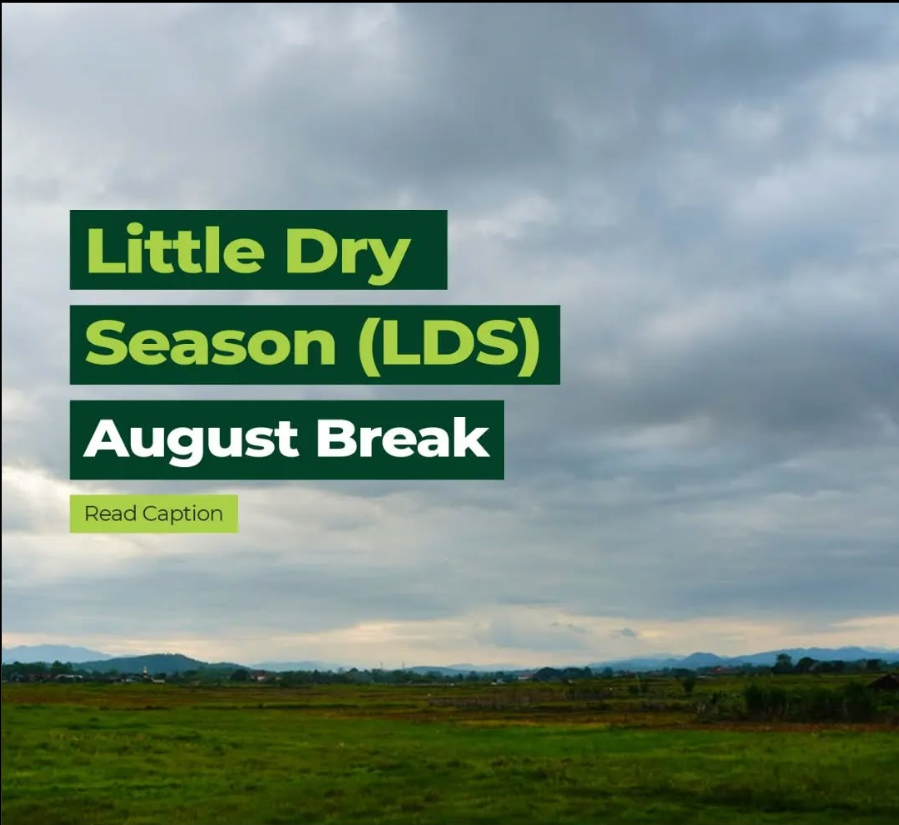
## Introduction
This project, conducted as part of my industrial training in Meteorology and Climate Science, analyzes the Little Dry Season (LDS) in Lagos, Nigeria. Motivated by a prolonged dry period observed during my internship (July-November), I investigated the temporal variability of the LDS over 20 years (2004-2023) using available rainfall data.

## Skills Demonstrated
This project combined data analysis and meteorological skills. I extracted and processed ERA5 rainfall data from the Climate in Africa website, deriving key metrics like 5-day mean and cumulative rainfall. Time series and statistical analyses revealed trends and variability in LDS characteristics. Visualizations, including a tree map and cumulative rainfall line graphs and bar charts communicated these insights. My meteorological background informed the interpretation of LDS characteristics. Technically, I used Excel, SQL, and Tableau.

## Research Overview
The Little Dry Season (LDS) is a climatological phenomenon in West Africa characterized by reduction in the amount and intensity of rainfall halfway into the wet season. It usually manifests between July and September.

## Problem Statement (Research Aims & Objectives)
This project aimed to analyze the temporal variability of key LDS characteristics in Lagos using the 5-day Cumulative Percentage Mean Rainfall method. Objectives included:
•	Determining LDS onset and retreat dates.
•	Analyzing interannual variability in LDS length, rainfall, rain days, and intensity.
•	Identifying trends and relationships between characteristics.
•	Identifying extreme values and their occurrence years.

## Data Sourcing
This study used daily rainfall data from the Copernicus ERA5 Reanalysis dataset, accessed via the Climate In Africa website. ERA5 is a high-resolution global atmospheric reanalysis produced by the European Centre for Medium-Range Weather Forecasts (ECMWF), combining various observational sources.

## Data Preparation
The raw daily rainfall data for Lagos from 2004 to 2023 was extracted and saved locally. I began the cleaning process by using Excel to explore the dataset, gaining insights into its structure and organization. This initial review guided my assessment of its relevance and quality using the ROCCC framework (Reliable, Original, Comprehensive, Current, and Cited). To ensure accuracy, I conducted an in-depth exploration, including data type validation, consistency checks, range verification, and identification of missing values and duplicates.
**Dataset**
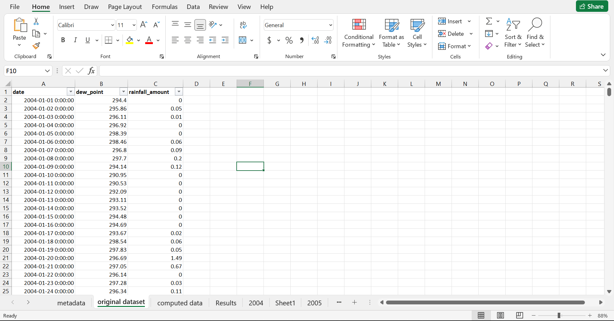

## Limitations
During exploration, I discovered that the daily rainfall values for 2017 were identical throughout the year. Despite redownloading the dataset to resolve the issue, the anomaly persisted. Consequently, I proceeded with the analysis while omitting data from 2017.

## Analysis Approach
LDS onset and retreat would be derived from the slope of the cumulative percentage graph of 5-day mean rainfall from which other LDS characteristics (length, rainfall amount, number of rain days and intensity) will then be calculated and compared over the years. 

## Data Processing: Computation of the 5-Day Cumulative Percentage Mean Rainfall
Anticipating the steps involved in the calculation, I realized a need to extract the data for each year into separate sheets before proceeding. 

1. Calculation of the 5-Day Mean Rainfall: Daily rainfall data were grouped into 5-day periods. The average daily rainfall for each 5-day period was calculated to smooth out short-term fluctuations and highlight broader rainfall trends. This was done using a combination of functions like “ROW()”, “INT()”, “helper column” and Pivot table in Excel.
- Created a helper column: I created a new column named “grouping” and added a formula to group the rows in sets of 5 “=INT((ROW(A1)-1)/5)+1”
- Created Pivot Table:  Created a Pivot table adding the helper column (“grouping”) to the Rows section, “rainfall amount” to the Values section and set it to calculate the Average.
- Edited Table: The result of the Pivot table was copied and repasted to be made editable. Then, the Row Label column with values 1, 2, 3, 4… 73 was changed to 5, 10, 15, 20… 365 representing days of year in pentads and the Average of Rainfall Amount column was renamed 5-day Mean Rainfall.

**Pivot Table**    |    **Edited Table**
:-------------------:|:----------------------:
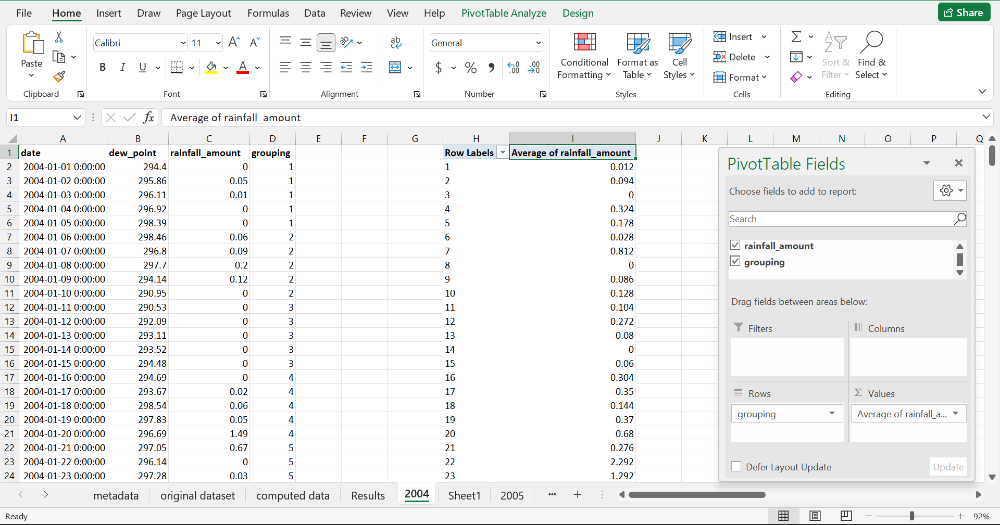|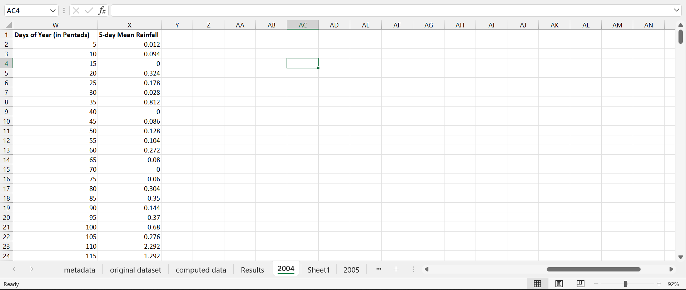

2. Calculation of Percentage Contribution: For each 5-day period, the percentage contribution to the annual total rainfall was calculated for each year. This was achieved by dividing the 5-day mean rainfall by the annual total rainfall and multiplying by 100. The annual total rainfall was deducted from the Pivot Table using sum of rainfall amount.
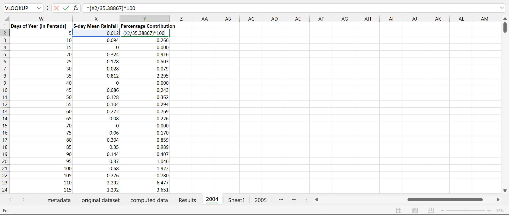

3. Calculation of Cumulative Percentage Rainfall: The cumulative percentage of rainfall received up to the end of each 5-day period was calculated by summing the percentage contribution of each 5-day period throughout the year. Where Y is the Percentage Contribution Column and Z is the Cumulative Percentage Column to be calculated, the formula used is: “Z2 = Y2”, “Z3 = Y3 + Z2” as seen below. 
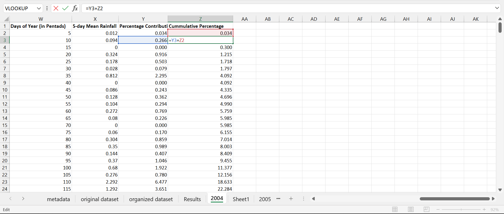

Compilation
The processes for each step of the calculation were repeated for all the years (2004 to 2023) and the results was compiled in a new sheet named **computed data.** 
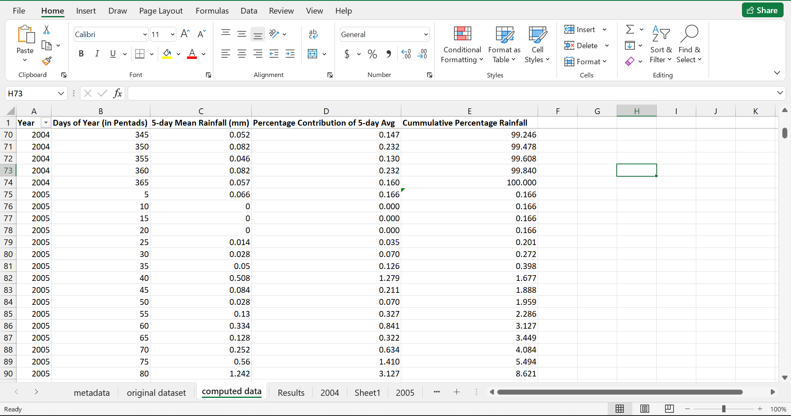

## Data Analysis / Visualization
Now that I have the data processed and compiled, I delved into analyzing to derive quality information relevant to the aim of the research. I would first identify the onset and retreat dates of LDS for each year from the available data from which I will then derive insights about other LDS characteristics

**- Identification of LDS Onset and Retreat:** The onset and retreat of the LDS were identified by visually inspecting the cumulative rainfall graph. The onset was marked by a significant decrease in the slope of the curve (first point of maximum negative curvature), indicating a reduction in the rate of rainfall accumulation. The retreat was marked by a renewed increase in the slope (second point of maximum positive curvature), signifying the resumption of heavier rainfall.
2004 Onset and Retreat Dates | 2 Onset and Retreat Dates
:--------------------:|:-------------------:
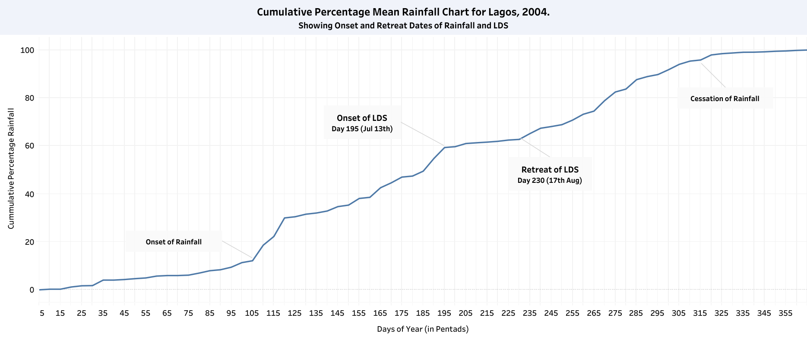|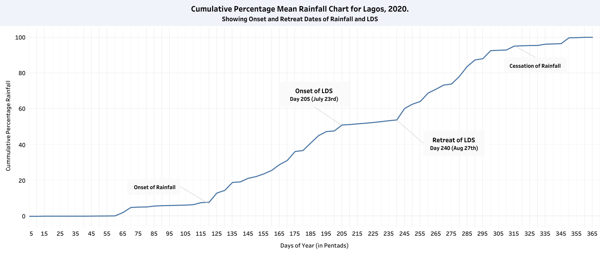

**- Calculation of other LDS Characteristics:** After identifying the onset and retreat dates of the LDS for each year within the study period (2004-2023), these dates were compiled in a table. This information was then used to calculate other key rainfall characteristics within the scope of this study, including length of LDS, number of rainy days, rainfall amount and intensity during LDS which would subsequently be compared across the 20-year period.
**Length of LDS = LDS Retreat Date – LDS Onset Date**
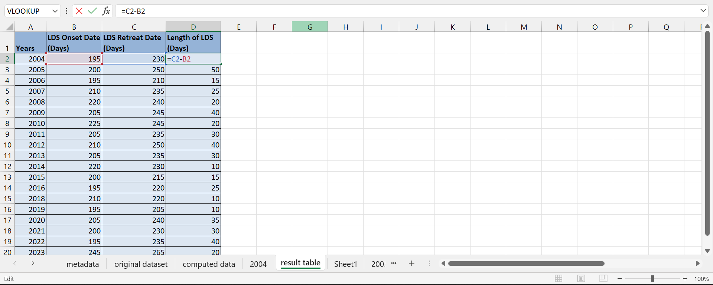

**Rainfall Amount = Sum of daily rainfall amounts for days within the identified LDS period.**
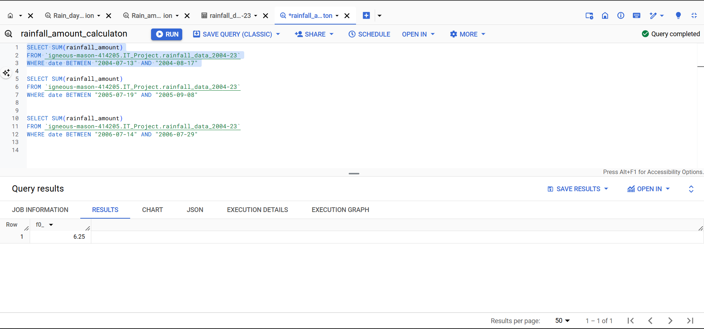

**LDS Intensity (Average Daily Rainfall) = rainfall amount / number of days.**
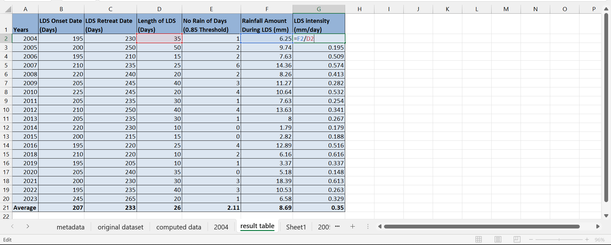

## Visualization
Different visuals were created to visualize the trend, variability and comparison of each LDS characteristics across the years. A tree map was used to visualize the intensity of the LDS across the 20-year period, with larger squares representing more intense dry seasons.

## Results
Onset Dates | Retreat Dates
:--------------:|:-------------:
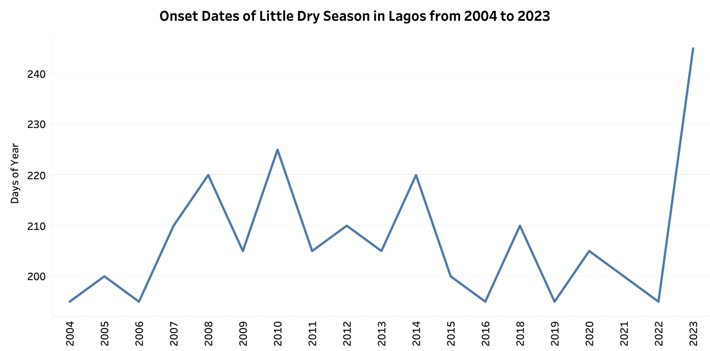|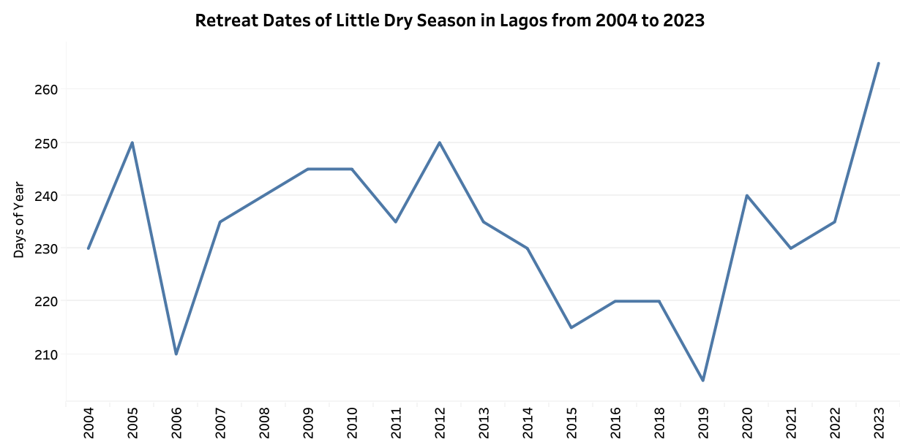

Lengths of LDS | Rainfall Amount During LDS
:--------------:|:--------------:
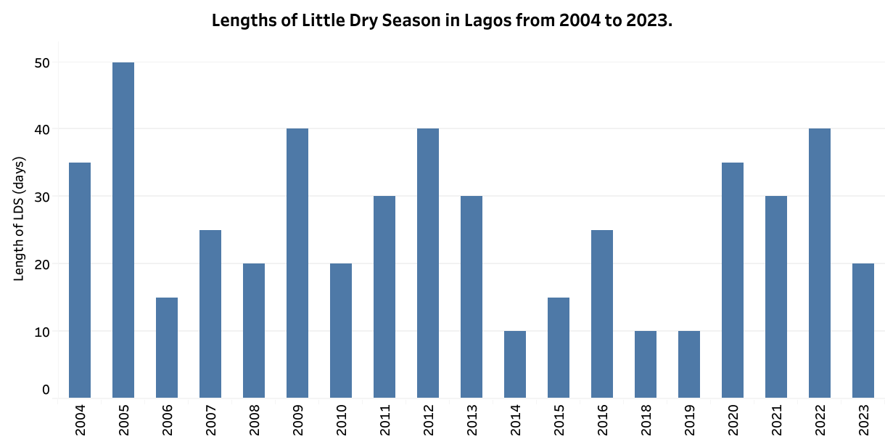|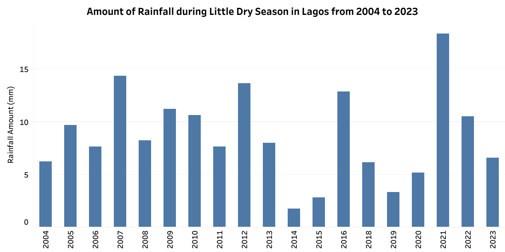

LDS Intensity | No of Rain Days 
:--------------:|:--------------:
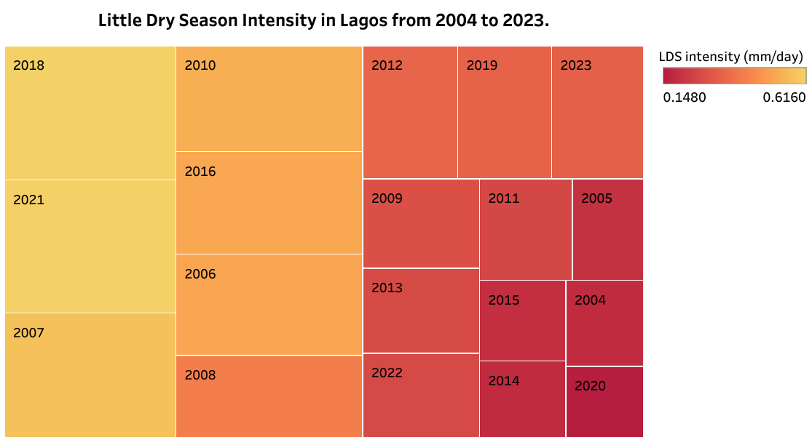|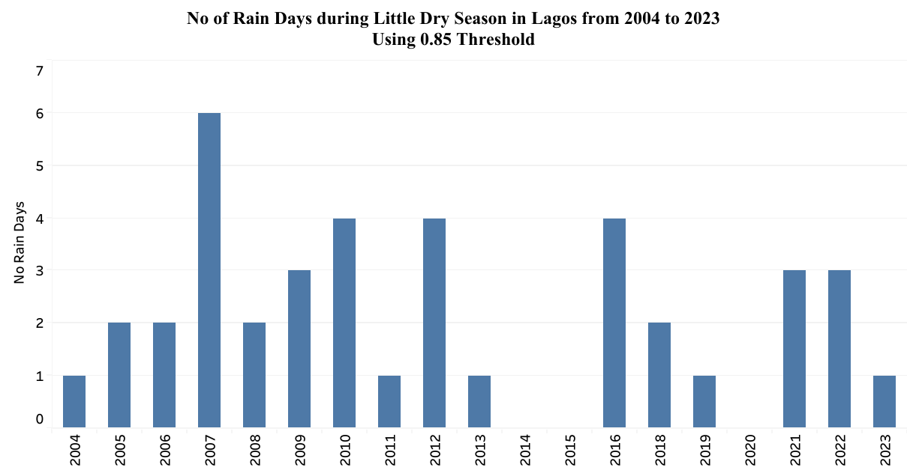

The analysis of ERA5 reanalysis data (2004-2023) revealed significant inter-annual variability in Lagos' Little Dry Season (LDS) characteristics.
**1. Onset & Retreat of LDS:** LDS onset varied by up to 50 days (July 14th/15th - September 2nd), with similar variation in retreat dates.
**2. Length of LDS:** LDS duration ranged from 10 to 50 days (average 26 days), impacting the length of the wet season.
**3. Rainfall Amount during LDS:** Total rainfall during the LDS varied considerably (1.79 - 18.39 mm), affecting water availability and agricultural practices.
**4. Number of Rain Days:** The number of rain days (≥ 0.85 mm) fluctuated between 0 and 6, influencing vegetation health and water recharge.
**5. LDS Intensity:** LDS intensity, measured as average daily rainfall, was highly variable. A tree map (Fig. X) highlighted years with the most (e.g., 2020, 2004) and least (e.g., 2018, 2021) intense LDS periods.

## Discussion and Conclusion
These findings demonstrate the dynamic nature of the LDS in Lagos and its potential impact on various sectors. The observed variability in onset/retreat, length, rainfall, and intensity can have significant consequences for agriculture, water resources, and disaster preparedness. The increased variability in recent years suggests potential shifts in LDS patterns, possibly due to climate change or other factors. Further research is needed to investigate these drivers and their implications for Lagos' ecosystems and human activities.

## Recommendations
•	Future studies could investigate the relationship between the LDS and other meteorological variables (e.g., temperature, humidity).
•	Further research is needed to explore the potential impacts of climate change on the LDS in Lagos.

